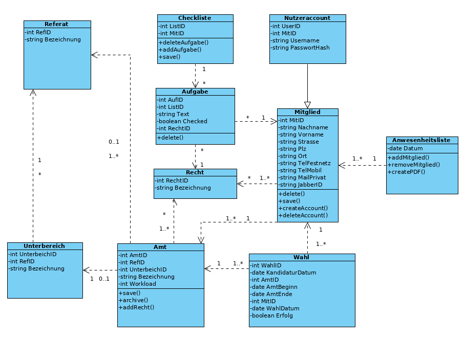

= Architecture Notebook <Projektthema>
Vorname Nachname <email@domain.org>; Vorname2 Nachname2 <email2@domain.org>; Vorname3 Nachname3 <email3@domain.org>
0.1, 01.11.2019 
:toc: 
:toc-title: Inhaltsverzeichnis
:sectnums:
// Platzhalter für weitere Dokumenten-Attribute 

== Zweck
Dieses Dokument beschreibt die Philosophie, Entscheidungen, Nebenbedingungen, Begründungen, wesentliche Elemente und andere übergreifende Aspekte des Systems, die Einfluss auf Entwurf und Implementierung haben.

//Hinweise: Bearbeiten Sie immer die Abschnitte 2-6 dieser Vorlage. Nachfolgende Abschnitte sind empfohlen, aber optional und sollten je nach Umfang der künftigen Wartungsarbeiten, Fähigkeiten des Entwicklungsteams und Bedeutung anderer architektureller Belange. 

//Anmerkung: Die Architektur legt wesentliche EINSCHRÄNKUNGEN für den Systementwurf fest und ist ein Schlüssel für die Erfüllung nicht-funktionaler Eigenschaften!

== Architekturziele und Philosophie
//Hinweise: Beschreiben Sie die Philosophie der Architektur, d.h. den zentralen Ansatz für ihre Architektur. Identifizieren Sie alle Aspekte, die die Philosophie beeinflussen, z.B. komplexe Auslieferung Aspekte, Anpassung von Altsystemen oder besondere Geschwindigkeitsanforderungen. Muss es besonders robust sein, um eine langfristige Wartung und Pflege zu ermöglichen?

//Formulieren Sie eine Reihe von Zielen, die die Architektur in ihrer Struktur und ihrem Verhalten erfüllen muss. Identifizieren Sie kritische Fragen, die von der Architektur adressiert werden müssen, z.B. besondere Hardware-Abhängigkeiten, die vom Rest des Systems isoliert werden sollten oder Sicherstellung der Funktionsfähigkeit unter besonderen Bedingungen (z.B. Offline-Nutzung).

* Plattformunabhängigkeit
* Nutzung von überall durch webserverzugriff
* Unterschiedliche Benutzergruppen mit unterschiedlichen Rechten
* einfache Architektur

== Annahmen und Abhängigkeiten
//[List the assumptions and dependencies that drive architectural decisions. This could include sensitive or critical areas, dependencies on legacy interfaces, the skill and experience of the team, the availability of important resources, and so forth]
* (wenige Nutzer) ohne Informatikerausbildung oder ähnlichem
* Stura Server vorhanden
* LXC Container wird bereitgestellt

== Architektur-relevante Anforderungen
//Fügen Sie eine Referenz / Link zu den Anforderungen ein, die implementiert werden müssen, um die Architektur zu erzeugen.
* Nutzung freier Lizensen
* Sicherung und Widerherstellung von Systemzuständen gewährleisten (zeitlich automatisiert)
* Nutzungsrechtesystem -> Benutzerklassen

== Entscheidungen, Nebenbedingungen und Begründungen 
//[List the decisions that have been made regarding architectural approaches and the constraints being placed on the way that the developers build the system. These will serve as guidelines for defining architecturally significant parts of the system. Justify each decision or constraint so that developers understand the importance of building the system according to the context created by those decisions and constraints. This may include a list of DOs and DON’Ts to guide the developers in building the system.] 

. Python seitens Auftraggeber gewünscht 
-> Forderung akzeptiert, da Sinnhaftigkeit dieser Wahl erkannt. Phython ist weit verbreitet und gut geeignet zum Programmieren von Webanwendungen.
. SQL Lite damit..
	* kein eigener Server aufgesetzt werden muss und zur zusätzlichen Sicherung, denn 	die Daten liegen nicht auf einem Datenbankserver vor? TODO
	* einfach zu implementieren und zu verstehen
	* Projektumfang eher klein -> SQL Lite reicht aus
. Django als Webframework, da ..
	* SQL Lite ist standard
	* in Python geschrieben - > leichte Anbindung
	* populär -> Communityunterstützung, viele Entwickler können daran 	weiterarbeiten

== Architekturmechanismen
//[List the architectural mechanisms and describe the current state of each one. Initially, each mechanism may be only name and a brief description. They will evolve until the mechanism is a collaboration or pattern that can be directly applied to some aspect of the design.]

//Beispiele: relationales DBMS, Messaging-Dienste, Transaktionsserver, Webserver, Publish-Subscribe Mechanismus

//Beschreiben Sie den Zweck, Eigenschaften und Funktion der Architekturmechanismen.

. Webserver : Speichern der Daten auf einem Server auf den von außen zugegriffen werden kann. Gängiger Architekturmechanismus für die Lagerung von Datenbanken.
. Relationales DBS: Am weitesten Verbreitet. Bringt die meisten Vorteile zur Verwaltung von gängigen Daten mit.
. Container (LXC): Einfach anzudocken an bestehendes System

== Wesentliche Abstraktionen
//[List and briefly describe the key abstractions of the system. This should be a relatively short list of the critical concepts that define the system. The key abstractions will usually translate to the initial analysis classes and important patterns.]
. Datenhaltung in einer relationalen Datenbank
. Objektorierntierte Programmierung

== Schichten oder Architektur-Framework
//[Describe the architectural pattern that you will use or how the architecture will be consistent and uniform. This could be a simple reference to an existing or well-known architectural pattern, such as the Layer framework, a reference to a high-level model of the framework, or a description of how the major system components should be put together.]

== Architektursichten (Views)
//[Describe the architectural views that you will use to describe the software architecture. This illustrates the different perspectives that you will make available to review and to document architectural decisions.]

Folgende Sichten werden empfohlen:

=== Logische Sicht
//Beschreibt die Struktur und das Verhalten Systemteilen, die hohen Einfluss auf die Architektur haben. Dies kann die Paketstruktur, kritische Schnittstellen, wichtige Klassen und Subsysteme sowie die Beziehungen zwischen diesen Elementen enthalten. Zudem sollten die physische und logische Sicht persistenter Daten beschrieben werden, wenn es diesen Aspekt im System gibt. Dies ist ein hier dokumentierter Teilaspekt des Entwurfs.

=== Physische Sicht (Betriebssicht)
//Beschreibt die physischen Knoten (Rechner) des Systems, der Prozesse, Threads und Komponenten, die in diesen Knoten ausgeführt werden. Diese Sicht wird nicht benötigt, wenn das System in einem einzelnen Prozess oder Thread ausgeführt wird.
. Webserver -> LXC Container -> Webanwendung (Django)

=== Use cases
//Eine Liste oder ein Diagramm der Use Cases, die architektur-relevante Anforderungne enthalten.

include::../aemter_verwalten.adoc[]
