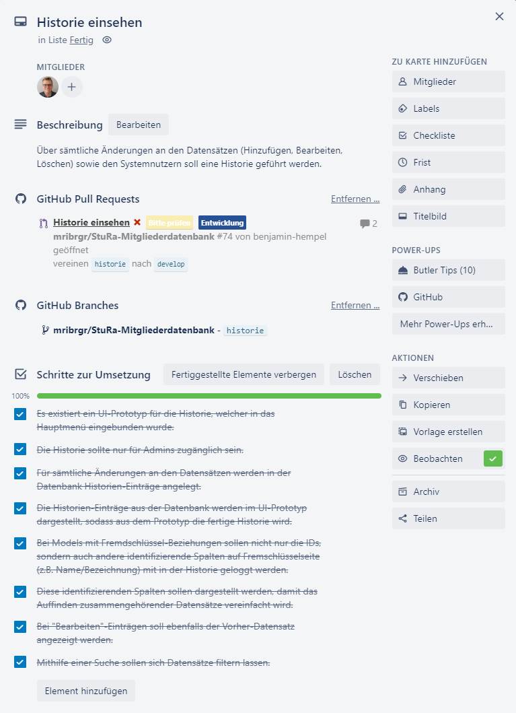

# Implementierung (BHe)

## Organisation und Scope der Work Items

Alle zu erledigenden Work Items wurden in unserem Trello-Board organisiert und zunächst der Spalte "Backlog" zugeordnet. Beim Hinzufügen eines neuen Work Items wurde diesem in der Regel bereits eine grobe Beschreibung der zu erfüllenden Kriterien hinzugefügt. 

.Beispiel eines Work-Items im Trello-Board

Zu Beginn umfasste ein Work Item in der Regel einen Use Case. Da ein Use Case in unserem Fall üblicherweise eine komplette CRUD-Funktionalität (hinzufügen, bearbeiten, ansehen, löschen) beinhaltet, waren die Work Items zu Beginn sehr aufwändig und zogen sich über 2-3 Iterationen bzw. 4-6 Wochen. Der Vortel wiederum ist, dass es somit für jeden Use Case einen Experten gab, welcher bei Fragen zu diesem Use Case den anderen Teammitgliedern zur Verfügung stand.  Dies wurde dadurch verstärkt, dass die Developer zuvor noch nicht mit Django gearbeitet haben und sich infolgedessen zunächst in das Framework einarbeiten mussten. Eine explizite Aufwandsschätzung, etwa in Form von Punkten oder Arbeitsstunden, wurde jedoch aufgrund des vergleichsweise kleinen Umfangs des Projekts nicht durchgeführt. 

Der Umfang (Scope) der Work Items nahm im Verlauf der Implementierung stetig ab. Das liegt daran, dass nach Implementierung der Use Cases schon ein Großteil der Funktionalität vorhanden war. Später hinzugestoßene Work Items bezogen sich in der Regel auf gewünschte Verbesserungen seitens der Stakeholder, kleinere Anpassungen oder Bugfixes. Somit wurden zu Beginn 0,33-0,5 Work Items pro Iteration und Teammitglied bearbeitet, während es am Ende aufgrund des geringeren Scopes pro Item 2-3 waren.

## Aufsetzen der Anwendungsstruktur

Zu Beginn des Semesters wurde das Grundgerüst der Anwendung, d.h. die Generierung der Django-Anwendung sowie der einzelnen Apps, durch ein Teammitglied aufgebaut. Außerdem wurde bereits eine erste Version des Datenbankmodells entsprechend des vorher erstellten Entwurfs implementiert. Weiterhin wurden bereits globale Abhängigkeiten wie die UI-Bibliothek Materialize und jQuery eingebunden und das Menü der Anwendung, bestehend aus Header und Footer, implementiert.

## Erstellen von UI-Prototypen

Vor der Implementierung der Funktionalität wurden zunächst UI-Prototypen für alle Use Cases umgesetzt. Diese wurden genutzt, um früh in der Entwicklung Feedback zur Benutzerführung einzuholen und eventuelle Probleme oder fehlende bzw. von der Vorstellung der Stakeholder abweichende Funktionen zu identifizieren. Außerdem konnte dadurch schnell eine gemeinsame Designsprache für die Anwendung gefunden werden, welche in allen Bereichen der App Verwendung findet. Da die erstellten Prototypen von Anfang an nicht als Wegwerf-Prototypen geplant waren, wurde bereits auf eine möglichst hohe Qualität der Benutzererfahrung und des Codes hingearbeitet.

## Ablauf der Abarbeitung eines Work Items

### Beginn der Iteration

Zu Beginn der Iteration wurden alle noch zu erledigenden Aufgaben im zweiwöchentlichen Iterationsmeeting betrachtet. Jeder Developer hatte anschließend die Möglichkeit, entsprechend der eigenen Interessen, Fähigkeiten und der verfügbaren Zeit die Work Items auszuwählen, welche er/sie erledigen möchte. Der Zeitaufwand pro Iteration und Developer war hierbei flexibel, es wurde aber darauf geachtet, dass jeder Developer summiert über alle Iterationen in etwa den gleichen Aufwand geleistet hat. Glücklicherweise kam es nicht dazu, dass Work Items nicht vergeben wurden oder ein Teammitglied sich weigerte, ein Item anzunehmen.

Hat ein Developer ein Work Item angenommen, wird dieses in Trello dem Mitglied zugewiesen und in die Spalte "Aktuelle Iteration" verschoben. Der Developer sieht sich außerdem noch im Meeting die bereits vorhandene Beschreibung sowie die Akzeptanzkriterien des Work Items an. Gegebenenfalls werden diese noch erweitert sowie eventuell aufgetretene Fragen geklärt.

### Branching-Strategie und Implementierung

* Meeting zur Iterationsmitte

### Ende der Iteration

## Feedback von Stakeholdern
