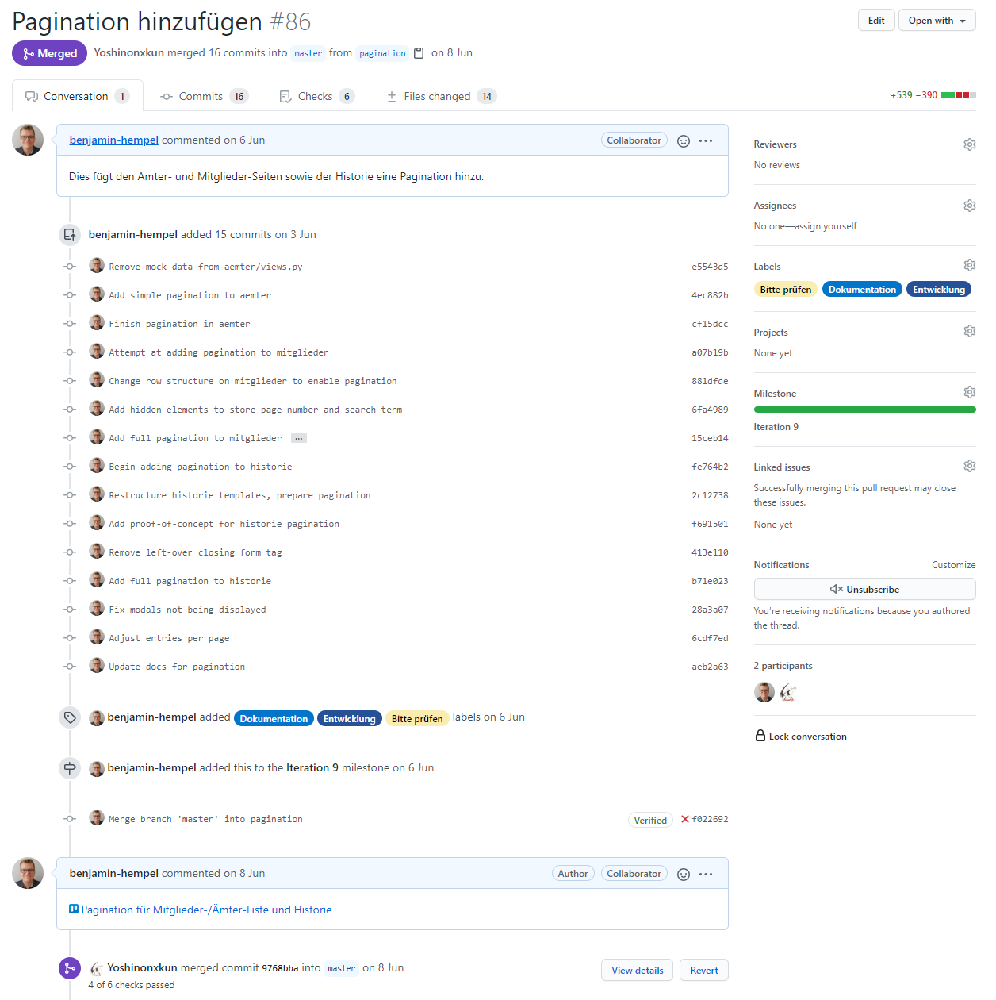

# Implementierung (BHe)

## Organisation und Scope der Work Items

Alle zu erledigenden Work Items wurden in unserem Trello-Board organisiert und zunächst der Spalte "Backlog" zugeordnet. Beim Hinzufügen eines neuen Work Items wurde diesem in der Regel bereits eine grobe Beschreibung der zu erfüllenden Kriterien hinzugefügt. 

.Beispiel eines Work-Items im Trello-Board
image::images/work_item_beispiel.png[]

Zu Beginn umfasste ein Work Item in der Regel einen Use Case. Da ein Use Case in unserem Fall üblicherweise eine komplette CRUD-Funktionalität (hinzufügen, bearbeiten, ansehen, löschen) beinhaltet, waren die Work Items zu Beginn sehr aufwändig und zogen sich über 2-3 Iterationen bzw. 4-6 Wochen. Der Vortel wiederum ist, dass es somit für jeden Use Case einen Experten gab, welcher bei Fragen zu diesem Use Case den anderen Teammitgliedern zur Verfügung stand.  Dies wurde dadurch verstärkt, dass die Developer zuvor noch nicht mit Django gearbeitet haben und sich infolgedessen zunächst in das Framework einarbeiten mussten. Eine explizite Aufwandsschätzung, etwa in Form von Punkten oder Arbeitsstunden, wurde jedoch aufgrund des vergleichsweise kleinen Umfangs des Projekts nicht durchgeführt. 

Der Umfang (Scope) der Work Items nahm im Verlauf der Implementierung stetig ab. Das liegt daran, dass nach Implementierung der Use Cases schon ein Großteil der Funktionalität vorhanden war. Später hinzugestoßene Work Items bezogen sich in der Regel auf gewünschte Verbesserungen seitens der Stakeholder, kleinere Anpassungen oder Bugfixes. Somit wurden zu Beginn 0,33-0,5 Work Items pro Iteration und Teammitglied bearbeitet, während es am Ende aufgrund des geringeren Scopes pro Item 2-3 waren.

## Aufsetzen der Anwendungsstruktur

Zu Beginn des Semesters wurde das Grundgerüst der Anwendung, d.h. die Generierung der Django-Anwendung sowie der einzelnen Apps, durch ein Teammitglied aufgebaut. Außerdem wurde bereits eine erste Version des Datenbankmodells entsprechend des vorher erstellten Entwurfs implementiert. Weiterhin wurden bereits globale Abhängigkeiten wie die UI-Bibliothek Materialize und jQuery eingebunden und das Menü der Anwendung, bestehend aus Header und Footer, implementiert.

## Erstellen von UI-Prototypen

Vor der Implementierung der Funktionalität wurden zunächst UI-Prototypen für alle Use Cases umgesetzt. Diese wurden genutzt, um früh in der Entwicklung Feedback zur Benutzerführung einzuholen und eventuelle Probleme oder fehlende bzw. von der Vorstellung der Stakeholder abweichende Funktionen zu identifizieren. Außerdem konnte dadurch schnell eine gemeinsame Designsprache für die Anwendung gefunden werden, welche in allen Bereichen der App Verwendung findet. Da die erstellten Prototypen von Anfang an nicht als Wegwerf-Prototypen geplant waren, wurde bereits auf eine möglichst hohe Qualität der Benutzererfahrung und des Codes hingearbeitet.

## Ablauf der Abarbeitung eines Work Items

### Beginn der Iteration

Zu Beginn der Iteration wurden alle noch zu erledigenden Aufgaben im zweiwöchentlichen Iterationsmeeting betrachtet. Jeder Developer hatte anschließend die Möglichkeit, entsprechend der eigenen Interessen, Fähigkeiten und der verfügbaren Zeit die Work Items auszuwählen, welche er/sie erledigen möchte. Der Zeitaufwand pro Iteration und Developer war hierbei flexibel, es wurde aber darauf geachtet, dass jeder Developer summiert über alle Iterationen in etwa den gleichen Aufwand geleistet hat. Glücklicherweise kam es nicht dazu, dass Work Items nicht vergeben wurden oder ein Teammitglied sich weigerte, ein Item anzunehmen.

Hat ein Developer ein Work Item angenommen, wird dieses in Trello dem Mitglied zugewiesen und in die Spalte "Aktuelle Iteration" verschoben. Der Developer sieht sich außerdem noch im Meeting die bereits vorhandene Beschreibung sowie die Akzeptanzkriterien des Work Items an. Gegebenenfalls werden diese noch erweitert sowie eventuell aufgetretene Fragen geklärt.

### Branching-Strategie und Implementierung

Zunächst wurde vom bearbeitenden Developer ein neuer Branch mit einem aussagekräftigen Namen angelegt, auf welchem anschließend die eigentliche Implementierung erfolgte. Bei der Implementierung selbst hatte jeder Developer freie Hand; bei Änderungen am Datenbankmodell oder der grundlegenden Struktur der Anwendung mussten aber alle anderen Teammitglieder informiert werden. Am Datenmodell mussten mehrmals Änderungen vorgenommen werden, insbesondere aufgrund von Feedback durch die Stakeholder (siehe Abschnitt unten). Diese gestalteten sich nicht immer einfach, da beispielsweise die Historie auf alle anderen Klassen zugreift und somit Inkonsistenzen in der Benennung oder dem Zugriff auf das Datenmodell entstanden sind.

In den Zwischenmeetings, welche immer etwa zur Mitte einer Iteration abgehalten wurden, wurde sich über den aktuellen Stand der in Bearbeitung befindlichen Work Items ausgetauscht. Fragen, Probleme und Unsicherheiten konnten so direkt im Meeting geklärt werden, etwa via geteiltem Bildschirm. Bei schwerwiegenden Problemen wurde vereinzelt auch Pair Programming durchgeführt oder ein anderer Developer zum betroffenen Work Item hinzugezogen.

Vor allem in späteren Iterationen wurde darauf geachtet, den Code direkt während der Implementierung ausführlich mittels Sphinx zu dokumentieren. Das hat den Vorteil, dass der bearbeitende Developer sowieso gerade im richtigen Kontext arbeitet und deshalb eine qualitativ hochwertigere Dokumentation entsteht. Außerdem vermeidet man dadurch, dass eventuell Teile des Codes nicht dokumentiert werden.

### Erstellen einer Pull Request und Review-Prozess

Nachdem die Implementierung fertiggestellt und vom bearbeitenden Developer händisch auf ihre Grundfunktionalität geprüft wurde, erstellte dieser eine Pull Request für den zuvor angelegten Branch. Diese wurde anschließend mit dem jeweiligen Work Item im Trello-Board verknüpft und die anderen Mitglieder beispielsweise per WhatsApp über das Anlegen der Pull Request informiert. Ein Reviewer wurde in dieser nicht festgelegt, da Pull Requests in der Regel von einem beliebigen Teammitglied mit freien Kapazitäten bearbeiten wurden. Außerdem wird das Work Item in Trello in die Spalte "Review benötigt" verschoben.

.Beispiel für eine Pull-Request

Der Reviewer checkt nun den Branch, für welchen die Pull Request gestellt wurde, aus und startet den Entwicklungsserver. Anschließend werden die im Work Item umgesetzten Bestandteile gründlich händisch überprüft, um bereits eventuelle Bugs oder Verbesserungsvorschläge einzubringen. Es wird außerdem darauf geachtet, dass die Umsetzung der Designsprache entspricht und der Quellcode ordentlich geschrieben und organisiert ist. Besteht Nachbesserungsbedarf, so wird dies in der Pull Request vermerkt und der bearbeitende Developer darüber informiert. In späteren Iterationen war es außerdem Pflicht, dass die Pull Request alle Tests, welche im Rahmen einer Continuous Integration mittels GitHub Actions automatisch ausgeführt wurden, besteht. Sollte es hier zu Abweichungen kommen, wurde der Tester informiert und mit diesem gemeinsam die Ursache für das Fehlschlagen der Tests ermittelt.

Ist der Reviewer mit den Ergebnissen zufrieden, wird die Pull Request gemerged und das Work Item auf dem Trello-Board in die Spalte "Tests benötigt" verschoben. Im Anschluss kümmert sich nun der Tester darum, die umgesetzte Funktionalität entsprechend zu testen.

### Ende der Iteration

Am Ende der Iteration wurde das Ergebnis der durch einen Developer abgeschlossenen Work Items den anderen Teammitgliedern vorgestellt. Dabei konnte auch erstes Feedback zur Implementierung eingeholt und ggf. Verbesserungsvorschläge eingebracht werden, noch bevor die Stakeholder das Ergebnis zu Gesicht bekamen.

Besonders bei den großen Work Items zu Beginn des Semesters, welche in der Regel einen ganzen Use Case umfassten, kam es häufig vor, dass dieses nicht in einer Iteration fertiggestellt werden konnte. Der/die bearbeitende Developer/in hatte die Verzögerung im Meeting zu begründen und das Work Item wurde in die nächste Iteration übernommen. Glücklicherweise kam es dadurch zu keinem Stillstand bei einem der Teammitglieder, es blieben also keine Work Items ewig unbearbeitet liegen.

## Feedback von Stakeholdern

In regelmäßigen Abständen wurden die Stakeholder zu gemeinsamen Meetings eingeladen, um den aktuellen Fortschritt der Implementierung zu zeigen und Feedback einzuholen. Dabei wurden mittels geteiltem Bildschirm die seit dem letzten Treffen umgesetzten Funktionalitäten gezeigt und die Stakeholder um Verbesserungsvorschläge gebeten.

Besonders viel Feedback erhielten wir dabei zu Beginn der Entwicklung zu den UI-Prototypen. Insbesondere bei den Checklisten und der Historie sind hier am Ende der Analyse immer noch offene Fragen geblieben, da der Kunde diese beiden Bestandteile zunächst nicht für uns nachvollziehbar und vollständig beschreiben konnte. Anhand der Prototypen konnte das Verständnis für das Zielbild dieser beiden Funktionalitäten geschärft werden und die gewünschten Änderungen noch vor der Implementierung der Anwendungslogik umgesetzt werden.

Ein zweiter größerter Punkt war die Benennung der "Ämter" und "Referate". Wie sich etwa zur Mitte der Entwicklung herausstellte, waren diese Benennungen zu eng gefasst, da es auch Funktionen im StuRa gibt, welche eben keine Ämter sind und streng genommen auch nicht zu einem Referat gehören. Deshalb haben wir uns nach einiger Diskussion auf die Bezeichnungen "Funktion" und "Organisationseinheit" geeinigt. Das Problem hierbei war, dass dies zahlreiche Umbenennungen sowohl im User Interface als auch im Quellcode zur Folge hatte, welche leider aufgrund anderer Prioritäten bei der Entwicklung nicht vollständig konsistent umgesetzt werden konnten.

Insgesamt war diese Form des Feedbacks jedoch äußerst hilfreich und ermöglichte es uns, die Anwendung bestmöglich auf die Wünsche des Kunden anzupassen.
